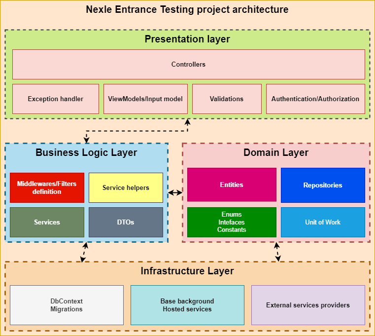

# Nexle Entrance Exam

**Author:** Anh Quoc Tran ([aquoc.hue@outlook.com](mailto:aquoc.hue@outlook.com), [LinkedIn](https://www.linkedin.com/in/anhquoc96/))

### Prerequisites
- .NET 6.0.
- Visual Studio 2022.
- MySQL Server 5.7 or [MySQL Server 8.0 with Legacy Authentication](https://dev.mysql.com/doc/mysql-installer/en/server-authentication-method.html) method.
- Docker and Docker Compose (optional).

### Architecture

This project is following [Clean Architecture](https://www.amazon.com/Clean-Architecture-Craftsmans-Software-Structure/dp/0134494164)
- **Architecture diagram**:



- **Folder structure**:

```
├───NexleInterviewTesting.Api <-- Presenation layer. Containing controllers, applied middlewares, authorization and authentication, validation and request view models, ASP.NET Core startup project.
├───NexleInterviewTesting.Application <-- Business logic layer. Containing services, DTO, some service helpers, middleware definitions, etc...
├───NexleInterviewTesting.Domain <-- Domain/data access layer. Containing entities, repositories, unit of work, some enums use on entities.
├───NexleInterviewTesting.Infrastructure <-- Infrastructure layer. Containing DbContext, DB migration, some external service connectors like Redis, Message Queue, etc... and Background Job.
```

### Database design
*This project can't use existing DB from Nexle server*


### Building

- Clone this repositories:
```sh
$ git clone https://github.com/anhquoctran/nexle-entrance-test
```
- Open the project in your Visual Studio by double click `src` > `NexleInterviewTesting` > `NexleInterviewTesting.sln`.
- Create `appsettings.json` in `NexleInterviewTesting.Api` project by copy all contents from`appsettings.example.json` file (because the `appsettings.json` file was ignored from git for security reasons).
- Modify the `ConnectionStrings`:

```json
{
  ...
  "ConnectionStrings": {
    "Default": "your_mysql_connection_string_here"
  }
  ...
}
```
- Change **JSON Web Token (JWT)** configurations in `appsettings.json`:

```json
{
  ...
  "Authentication": {
    "JwtBearer": {
      "Audience": "",
      "SecurityKey": "",
      "Issuer": ""
    }
  }
  ...
}
```
- Run the **database migration**:
  - Via `Package Manager Console`:
    -  Select `NexleInterviewTesting.Infrastructure` as `Default project`
    - Run this command to apply the migration:
      ```powershell
      Update-Database
      ```
      The default initial migration will be applied.
  - Via `.NET Core CLI Tools`:
    - Install `Entity Framework Core tools`
      ```bash
      $ dotnet tool install --global dotnet-ef
      ```
    - Apply the migration:
      ```bash
      $ dotnet ef database update --project "NexleInterviewTesting.Infrastructure/NexleInterviewTesting.Infrastructure.csproj" --startup-project "NexleInterviewTesting.Api/NexleInterviewTesting.Api.csproj"
      ```
- Start the application by click the button `IIS Express` in Visual Studio to start the `NexleInterviewTesting.Api` project by IIS Express. Application will be served at `http://localhost:16442` by default.

#### Postman collection
If you need Postman collection, please import it from file `nexle_entrance_api.json` under `postman` folder. <a href="postman/nexle_entrance_api.json" target="_blank">Get it</a>.

#### OpenAPI documentation (Swagger UI)
This project has been configured to use Swagger API documentation with OpenAPI standard. If you navigate to the root of route `http://localhost:13583`, you will see the Swagger UI like this:


**Note:** Swagger run on development environment only, so if you run on Docker or Release build, you won't see Swagger UI.

### Running with Docker Compose

To containerize this application with **Docker Compose**, you need navigate to the `src` directory, and then open your favourite terminal like **Command Prompt**, **Powershell**, etc... and execute below command:

```powershell
docker compose up -d --build
```
This command will build the Docker image of our project (`--build` flag) and start the container from built image (`up` command) with detached mode (`-d` flag). After that, if the container has been run successfully, our api will be served at `http://localhost:5001` (defined on `docker-compose.yml`)
The Database migrations will be applied automatically when the DB's container has started.

